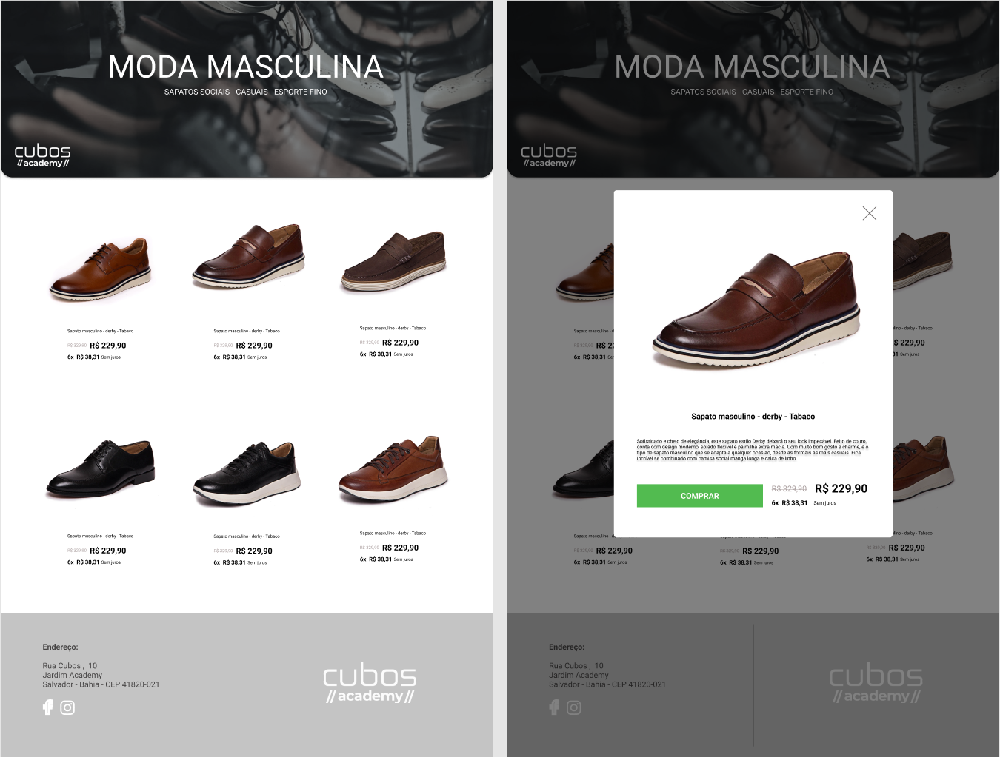

<h1 align="center"> Página Cubos Shoes </h1>

Simulação de uma página de venda de calçados.

  <a href="#-tecnologias">Tecnologias</a>&nbsp;&nbsp;&nbsp;|&nbsp;&nbsp;&nbsp;
  <a href="#-projeto">Projeto</a>&nbsp;&nbsp;&nbsp;|&nbsp;&nbsp;&nbsp;
  <a href="#-layout">Layout</a>&nbsp;&nbsp;&nbsp;

 

  

## 🚀 Tecnologias

Esse projeto foi desenvolvido com as seguintes tecnologias:

- ReactJS
- HTML e CSS
- JavaScript
- Git e Github

## 💻 Projeto

Essa é uma página que simula uma página de venda de calçados. O intuito desse projeto é o aprendizado e fixação dos conteúdos de React.

## 🔖 Layout

Você pode visualizar o layout do projeto através [DESSE LINK](https://www.figma.com/file/phwfubXivWfqIuCahLn14K/figma?node-id=0%3A1&t=vQQABvRCWKlGp2SZ-1). É necessário ter conta no [Figma](https://figma.com) para acessá-lo.
